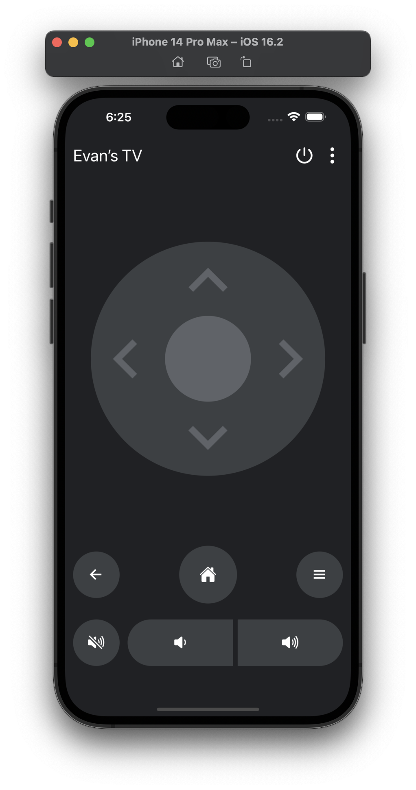

# fire-rc

A mobile application/server for remotely controlling Amazon Fire TVs using adb (Adroid Debug Bridge)

### Setup

1. Clone the monorepo

   `git clone https://github.com/evancolewright/fire-rc.git`

2. Change directory to the project

   ` cd fire-rc`

3. Install dependencies

   `yarn`

4. Run tests

   `yarn run test`

5. Start the server and the React Native metro bundler

   ` yarn run start:mobile`
   ` yarn run start:api`

### Licese

MIT
